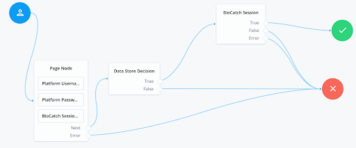
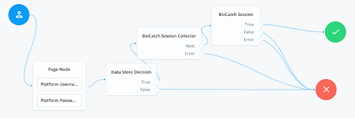

# BioCatch-Auth
A collection of nodes and authorization policies for ForgeRock's [Identity Platform][forgerock_platform] 7.0 and 
above as well as identity cloud.

## BioCatch Information

BioCatch prevents fraud while providing online and mobile users with a frictionless experience. The platform develops behavioral biometric profiles of online users to recognize a wide range of human and non-human cybersecurity threats including malware, remote access trojans (RATs), and robotic activity (bots).

BioCatch provides: 
* Identity proofing – analyzing multiple dimensions of how information is entered such as 
application fluency, navigational fluency, and data familiarity to detect the use of stolen or synthetic identities 
in filling out online applications. 
* Continuous authentication – BioCatch selects 20 unique features from its 500+ 
patented behavioral profiling metrics to analyze a user's behavior throughout a session – without any disruption in 
the digital experience. It compares user behavior in real time against the profile to return an actionable risk score
. 
* Fraud Prevention – BioCatch goes beyond traditional solutions, circumventing the need to maintain malware or bot 
libraries or rely on known device IDs or IP addresses to catch fraud. The Invisible Challenges approach can identify MitB, device spoofing, and RAT-in-the-Browser, providing real-time fraud alerts and minimizing false alarms.

When BioCatch is integrated via ForgeRock, ForgeRock will handle all backend process, calling BioCatch API via the 
ForgeRock AuthZ engine and taking actions based on the BioCatch Score.

## Installation

The BioCatch-Auth tree nodes and BioCatch Condition Type will be packaged as a jar file using the maven build tool and will be deployed in to the ForgeRock Access Management (AM) application WEB-INF/lib folder which is running on tomcat server.

Download the Biocatch jar from Github repository in the [releases section](https://github.com/ForgeRock/biocatch-authorization-condition/releases/latest).

Copy the .jar file from the ../target directory into the ../web-container/webapps/openam/WEB-INF/lib directory where AM is deployed.

In case BioCatchCondition should be added to existing policy, follow the following explanation on how to update existing policy with new condition: https://backstage.forgerock.com/docs/am/6/authorization-guide/#add-custom-policy-impl-to-existing-apps

# BioCatch-Auth Tree Configuration

Following are the nodes that will be available after deploying the jar file:

* BioCatch Session Collector Node - This node will collect customerSessionID (the unique session identifier) from the
 end user to call getScore API. There are no configurable attributes for it.

* BioCatch Session Node - This node will call BioCatch init API to initialize a session, connecting the session with 
specific user, connecting the client and server.

Attributes to be configured are:
* BioCatch End Point : Endpoint URL of BioCatch to hit init API.
* Customer Id : The customer or project identifier provided by BioCatch.

* BioCatch Profiler Node - This node will inject the Biocatch javascript SDK into the page.

Attributes to be configured are:
* JavaScript SDK URL : The URL to the javascript SDK URL.

## Configuring BioCatch-Auth Tree

This section depicts configuration of BioCatch-Auth Auth Tree

* Configure BioCatch-Auth Tree as shown below

### Example Tree 1

The example flow above will use the Biocatch Session Profiler node to inject the javascript into the page. It will generate and store a Customer Session ID, when will then be used in the BioCatch Session node to make the API call to the BioCatch scoring initiate API.

### Example Tree 2

The example flow above is used when the JavaScript is injected without the Biocatch Session Profiler Node. Instead the JavaScript is injected in the customers application, and the customer Session ID will be sent to ForgeRock, and collected in the Biocatch Session Collector node.

# BioCatchCreate the policy condition script

1. Log into ForgeRock Identity Cloud
2. Go to Auth Scripts -> New Scripts
3. Select policy condition and give the script a name
4. Copy the biocatchPolicyScript.js from this github repository and paste it into the JavaScript text box.
5. Modify the configuration values in the top section of the script

Attributes to be configured are:
* biocatchEndpoint: Biocatch endpoint
* customerId: Biocatch customerID
* minScore: Minimum score allowed from BioCatch
* maxScore: Maximum score allowed from BioCatch
* advices: The advices to be returned in a fraudulent request

# BioCatch-Auth Authorization Policy Configuration:
1. Log into ForgeRock AM console
2. Go to Authorization -> Policy Set -> {policy} -> Environments -> Add environment condition  -> select script -> choose configured BioCatch script

